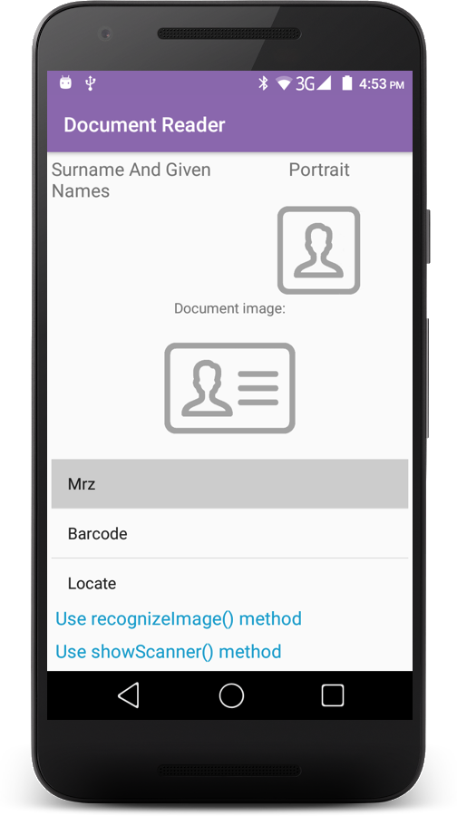
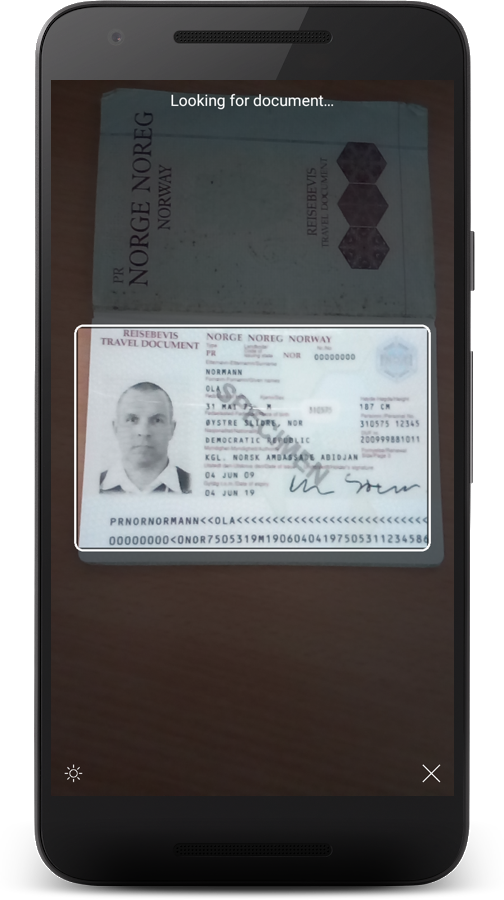
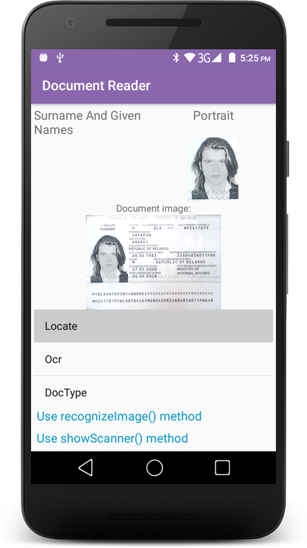

# Regula Document Reader (Android version)

The DocumentReader is a SDK to read various kinds of identification documents, passports, driving licenses, ID cards and etc. It's fully working ***offline***.
You can use native camera to scan the documents or image from gallery for extract all data from it.
We have provided a simple application that demonstrates the ***API*** calls you can use to interact with the DocumentReader Library. [Just take me to the notes!](https://github.com/regulaforensics/DocumentReader-Android/wiki)

If you have any questions, feel free to [contact us](mailto:support@regulaforensics.com).

  

#

* [How to build demo application](#how_to_build_demo_application)
* [How to add DocumentReader library to your project](#how_to_add_documentreader_library_to_your_project)
* [Troubleshooting license issues](#troubleshooting_license_issues)
* [Documentation](#docs)
* [Additional information](#additional_information)

## <a name="how_to_build_demo_application"></a> How to build demo application
1. Get trial license for demo application at [licensing.regulaforensics.com](https://licensing.regulaforensics.com) (`regula.license` file).
1. Clone current repository using command `git clone https://github.com/regulaforensics/DocumentReader-Android.git`.
1. Download and install latest [JDK](http://www.oracle.com/technetwork/java/javase/downloads/index.html).
1. Download and install latest [Android Studio](https://developer.android.com/studio/index.html).
1. Copy file `regula.license` to `DocumentReader-sample/app/src/main/res/raw` folder. 
1. Launch Android Studio and select _Open an existing Android Studio project_ then select _DocumentReader-sample_ project in file browser.
1. Download additional files proposed by Android Studio to build project (build tools, for example).
3. Change application ID to specified during registration of your license key at [licensing.regulaforensics.com](https://licensing.regulaforensics.com) (`com.regula.documentreader` by default).
1. Select appropriate build variant and run application.

## <a name="how_to_add_documentreader_library_to_your_project"></a> How to add DocumentReader library to your project

DocumentReader libraries are available in our [Maven repository](http://maven.regulaforensics.com/RegulaDocumentReader/com/regula/documentreader/). To install them, simply add the following lines to your project `build.gradle`

```gradle
implementation ('com.regula.documentreader:api:+aar'){
	transitive = true
}
```

And one of library depend on functionality which you want and license abilities:

Loading **Full** library edition (for **x86** architecture):
```gradle
implementation 'com.regula.documentreader.fullrfid:core:+@aar'
```

Loading **Full** library edition (for **ARMv7** architecture):
```gradle
implementation 'com.regula.documentreader.full:core:+@aar'
```

Loading **Core** library edition:
```gradle
implementation 'com.regula.documentreader.core:core:+@aar'
```

Loading **Bounds** library edition:
```gradle
implementation 'com.regula.documentreader.bounds:core:+@aar'
```

Loading **Barcode** library edition:
```gradle
implementation 'com.regula.documentreader.barcode:core:+@aar'
```

Loading **MRZ** library edition:
```gradle
implementation 'com.regula.documentreader.mrz:core:+@aar'
```

Loading **MRZ-Barcode** library edition:
```gradle
implementation 'com.regula.documentreader.barcodemrz:core:+@aar'
```

Loading **OCR** library edition:
```gradle
implementation 'com.regula.documentreader.ocrandmrz:core:+@aar'
```

Loading **Bank Card** library edition:
```gradle
implementation 'com.regula.documentreader.creditcard:core:+@aar'
```

## <a name="troubleshooting_license_issues"></a> Troubleshooting license issues
If you have issues with license verification when running the application, please verify that next is true:
1. OS you are using is the same as in the license you received (Android).
1. Application ID is the same that you specified for license.
1. Date and time on the device you are trying to run the application is correct and inside the license validity term.
1. You are using the latest release of the SDK.
1. You placed the license into the correct folder as described here [How to build demo application](#how_to_build_demo_application) (`DocumentReader-sample/app/src/main/res/raw`).

## <a name="docs"></a> Documentation
You can find documentation on API [here](https://regulaforensics.github.io/DocumentReader-Android/).

## <a name="additional_information"></a> Additional information
Use [Wiki](https://github.com/regulaforensics/DocumentReader-Android/wiki) to get more details. If you have any questions, feel free to [contact us](mailto:support@regulaforensics.com).
